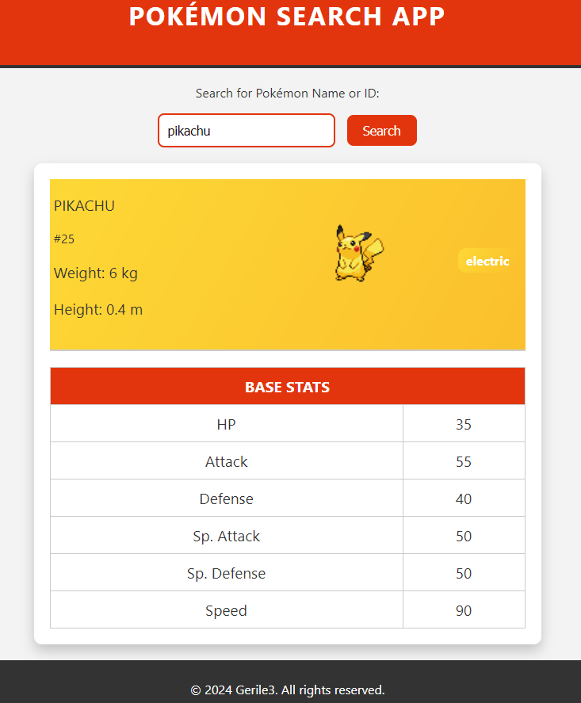

# Pokémon Search App

Welcome to the **Pokémon Search App**! This is a simple and intuitive web application where users can search for Pokémon by their name or ID and retrieve detailed information, including base stats, types, height, weight, and a visual sprite.

## Live Demo

Check out the live demo of the Pokémon Search App [here](https://gerile3.github.io/pokemon-search/)

## Technologies Used

- **HTML5**: For structuring the content.
- **CSS3**: For styling the app, including gradients based on Pokémon types and a responsive design.
- **JavaScript**: For handling the search functionality, interacting with the Pokémon API, and rendering the results.

## Usage

1. Enter a **Pokémon name** (e.g., "pikachu") or **ID** (e.g., 25) into the search bar.
2. Click on the **Search** button or press **Enter**.
3. View the Pokémon’s stats, types, height, weight, and sprite in the card below.

### Pokémon ID Range

- You can search Pokémon with IDs ranging from **1 to 1025**. If you enter a number outside this range, the app will prompt you to enter a valid ID.

### Type-Based Backgrounds

The background of the Pokémon card will automatically change depending on the primary type of the Pokémon. For example:
- **Fire-type** Pokémon will have a fiery red/orange background.
- **Water-type** Pokémon will have a cool blue background.

## API Reference

This app uses the [PokéAPI Proxy](https://pokeapi-proxy.freecodecamp.rocks/) to fetch Pokémon data.

